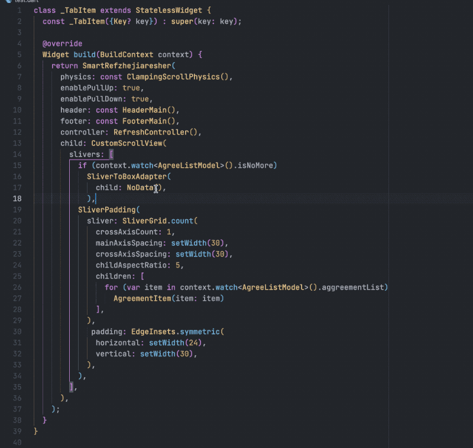
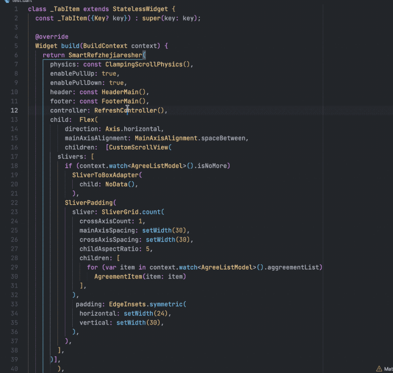
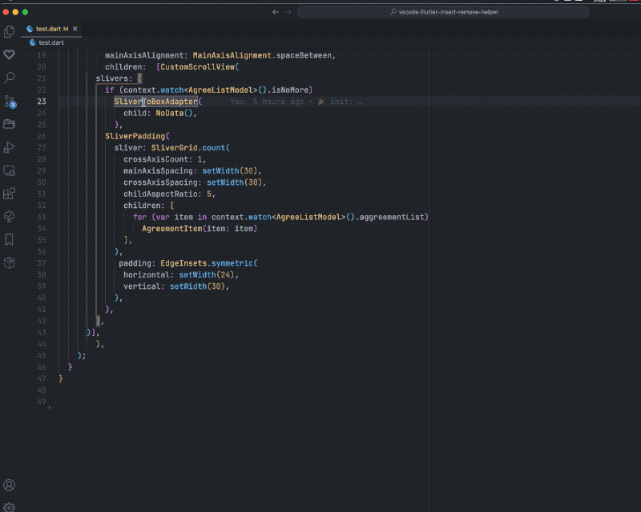

# Flutter Insert and Remove Helpers VSCode Extension

This extension currently Help you quickly insert and remove Widgets in fluttter, no need to selection, select the corresponding Widget right click can be

<!-- 👉 <https://marketplace.visualstudio.com/items?itemName=mthuong.vscode-flutter-freezed-helper> -->

## Features

### insert a Parent Widget

### remove a Parent Widget

### insert a Parent and Sibling Widget

### split and extraction Widget

## If you like, you can check out my other VSCode Extension
Flutter riverpod Helpers <https://github.com/EvStorM/vscode-flutter-riverpod-helper>
