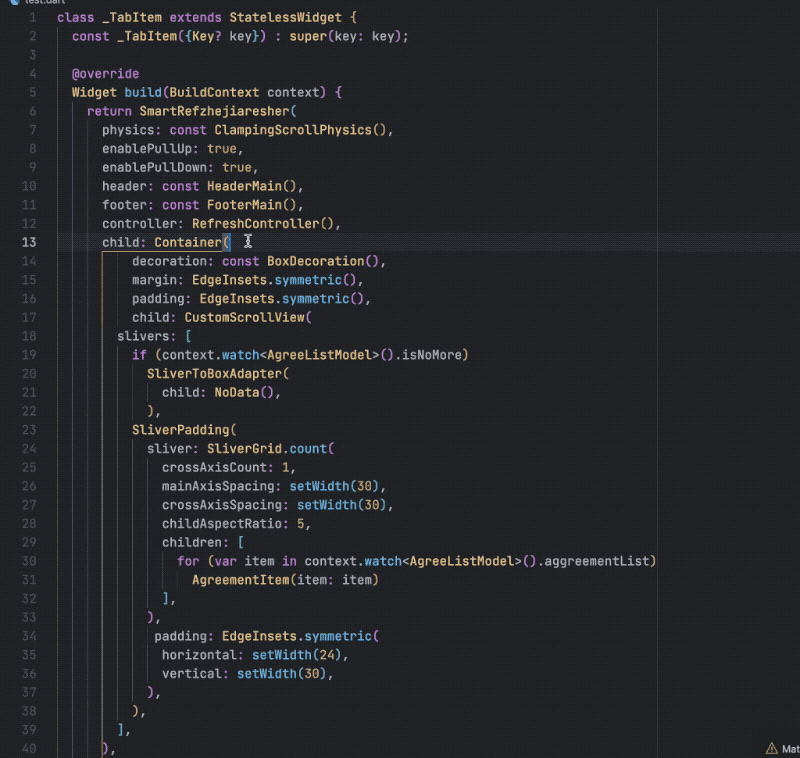

# Flutter Insert and Remove Helpers VSCode Extension

This extension currently Help you quickly insert and remove nodes in fluttter, no need to selection, select the corresponding node right click can be

<!-- 👉 <https://marketplace.visualstudio.com/items?itemName=mthuong.vscode-flutter-freezed-helper> -->

## Features

### insert a Parent node

### remove a Parent node

### insert a Parent and Sibling node

## If you like, you can check out my other VSCode Extension
Flutter riverpod Helpers <https://github.com/EvStorM/vscode-flutter-riverpod-helper>
